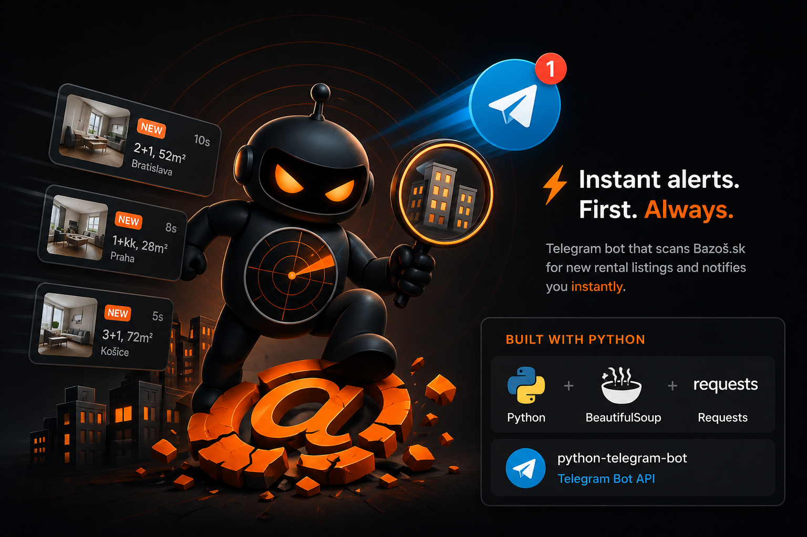

Telegram bot that monitors [reality.bazos.sk](https://reality.bazos.sk) and sends new apartment rental listings matching your filters.

## Features

- Scrapes `reality.bazos.sk/prenajmu/byt/` with configurable filters (postal code, radius, price range, keyword).
- Fetches full photo gallery from each listing detail page — sends as a Telegram album (up to 10 photos).
- Parses author name from the detail page.
- Deduplicates via SQLite — each listing is sent exactly once.
- All filters are editable via inline menus in Telegram, no redeployment needed.
- On first start, marks the current listings as seen — only genuinely new ones will be sent.

## Bot Commands

| Command | Description |
|---|---|
| `/start` | Subscribe and open the menu |
| `/menu` | Open the main menu |
| `/check` | Force-check right now |
| `/filters` | Show current filters |
| `/stop` | Unsubscribe |
| `/help` | Help |

## Menu Structure

**Main menu:**
- **Check now** — force a scrape outside the scheduled interval.
- **Filters** — tap any filter to open its editor with preset buttons or free-text input.
- **Statistics** — ticks run, listings sent, errors, last check time, contacted/disliked counts.
- **Pause / Resume** — temporarily stop notifications.
- **Clear cache** — forget all seen listings (with confirmation).
- **Unsubscribe** — delete all data (with confirmation).
- **Contacted** — paginated list of listings you marked as contacted.
- **Disliked** — paginated list of listings you rejected.

**Under each listing:**

Each listing arrives as a photo album followed by an action message with buttons:

| Button | Action |
|---|---|
| Open on bazos | Direct link to the listing page (phone number is behind SMS verification on bazos — open there to reveal it) |
| Contacted | Mark that you already reached out. Button shows a checkmark. |
| Dislike | Send to the disliked list |
| Reset | Clear the status |

## Filter Keys

| Key | Description | Valid values |
|---|---|---|
| `hlokalita` | Postal code (center point) | 5 digits, e.g. `04001` |
| `humkreis` | Search radius, km | 0/1/2/5/10/20/30/50/75/100 |
| `cenaod` | Min price, EUR | number or empty |
| `cenado` | Max price, EUR | number or empty |
| `hledat` | Keyword search | up to 100 chars |
| `order` | Sort order | empty (by date), `1` (cheapest), `2` (most expensive) |

## Local Development

```bash
pip install -r requirements.txt

# Get a token from @BotFather in Telegram
export TELEGRAM_BOT_TOKEN=123456:ABC...
export CHECK_INTERVAL_SEC=600
export DB_PATH=./bazos.sqlite3

python bot.py
```

Open the bot in Telegram and send `/start`.

## Deployment on fly.io

> Fits within the free trial. After that: ~$1.94/mo for shared-cpu-1x@256MB + $0.15/GB for the volume.

```bash
# Install flyctl
# Windows:  iwr https://fly.io/install.ps1 -useb | iex
# Mac/Linux: curl -L https://fly.io/install.sh | sh

fly auth login

# Inside the project directory
fly launch --no-deploy --copy-config
# Choose a globally unique app name, region: fra, no Postgres/Redis

# Persistent volume for SQLite
fly volumes create bazos_data --region fra --size 1

# Bot token as a secret
fly secrets set TELEGRAM_BOT_TOKEN=123456:ABC...

# Deploy
fly deploy
```

### Post-deploy verification

```bash
fly status   # 1 machine in state=started
fly logs     # look for: "starting bot, interval=600s"
```

Send `/start` to your bot in Telegram. New listings will arrive within the first polling interval (~10 min by default).

## Architecture

```
bot.py        — Telegram handlers, callback router, JobQueue (polling loop)
menus.py      — inline keyboard layouts, callback_data conventions
scraper.py    — HTTP fetch + BeautifulSoup parsing of list and detail pages
storage.py    — SQLite: subscribers, filters, seen-ads, statuses, stats
Dockerfile    — python:3.12-slim
fly.toml      — 1 shared-cpu machine + persistent volume
```

Callback data format: `<scope>:<action>[:<args>]`, fits within Telegram's 64-byte limit:
- `m:*` — main menu actions (`m:check`, `m:filters`, `m:pause`, `m:list:contacted:0`, ...)
- `f:edit:<key>` / `f:set:<key>:<val>` / `f:custom:<key>` / `f:clear:<key>`
- `ad:c:<id>` / `ad:d:<id>` / `ad:n:<id>` — contacted / disliked / reset

## Known Limitations

- **Phone numbers** on bazos require SMS verification — automated retrieval is not possible. Use the "Open on bazos" button to reveal the number manually.
- **Rate limiting** — default poll interval is 10 minutes, which is safe. Do not go below 5 minutes.
- **HTML structure changes** — if bazos updates their markup, the `.inzeraty` selector may break. Check logs if listings stop arriving.
- **fly.io volume** — do not delete the volume on redeploy; it holds the SQLite database with your history and filters.

## Roadmap

- Multiple filter profiles per chat.
- Support for other bazos categories (not just `prenajmu/byt`).
- Alert if 0 listings returned for N consecutive ticks (parser broken or IP banned).
